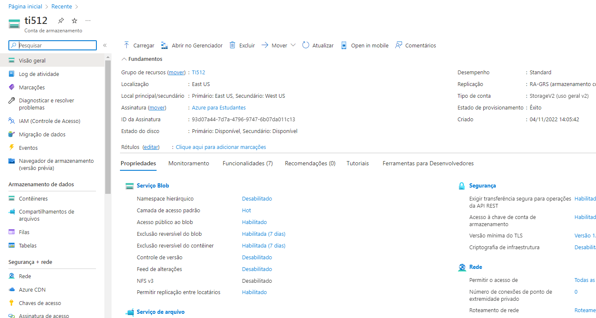
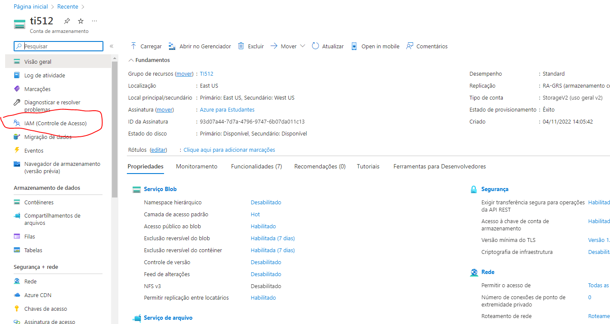
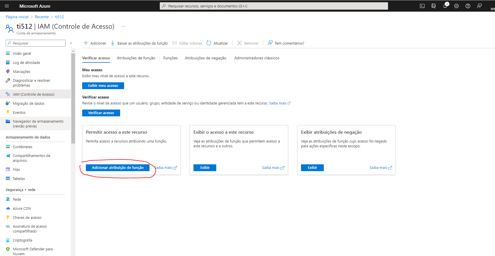
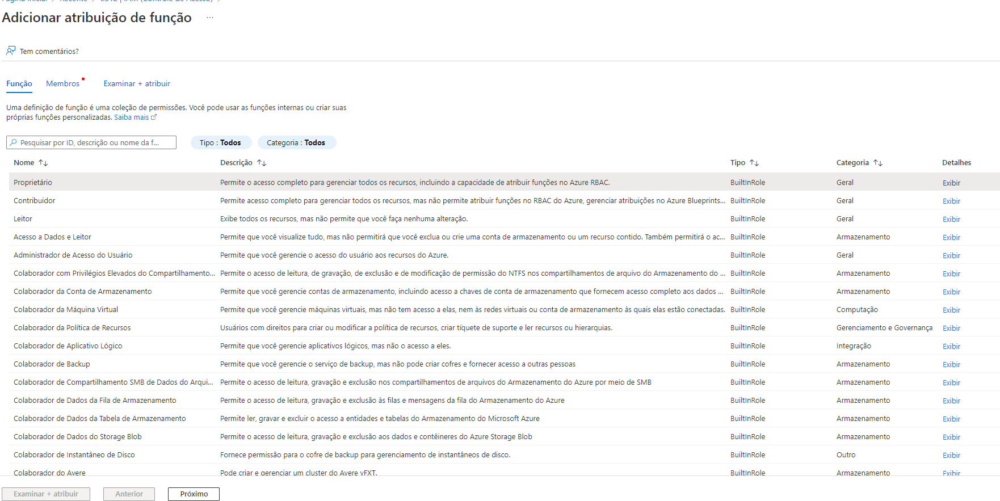
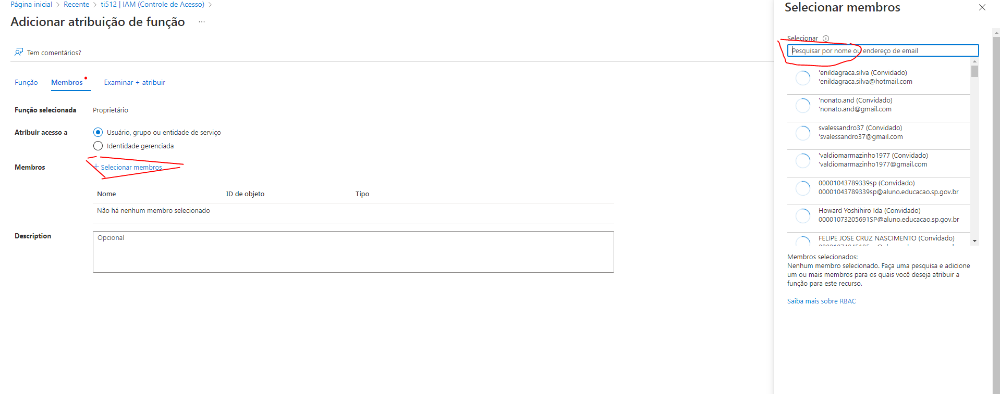
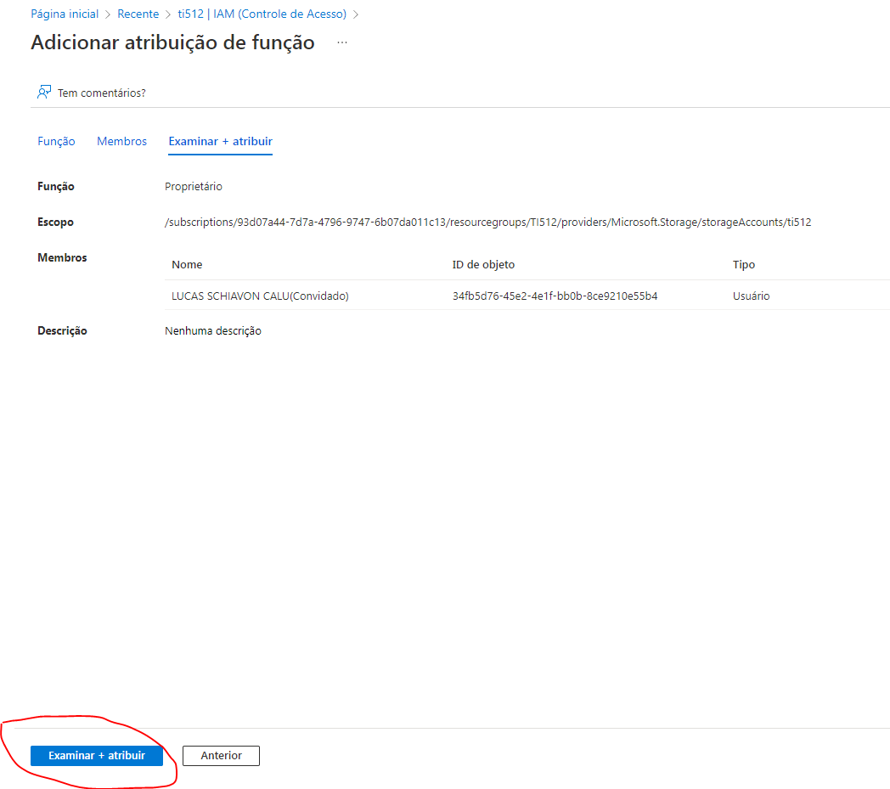

# AZ-900-ADD-AND-REMOVE-PERMISSIONS

Acesse https://portal.azure.com/#home

SELECIONE O RECURSO DESEJADO PARA DAR OU REMOVER PERMISSÕES

CLIQUE EM IAM CONTROLE DE ACESSO

CLIQUE EM ADICIONAR ATRIBUIÇÃO DE FUNÇÃO

ESCOLHA A FUNÇÃO DESEJADA

SELECIONE OS MEMBROS E ATRIBUA A FUNÇAO DESEJADA

CLIQUE EM EXAMINAR E ATRIBUIR

# Parabéns você atribuiu/editou uma função/permissão com sucesso!

